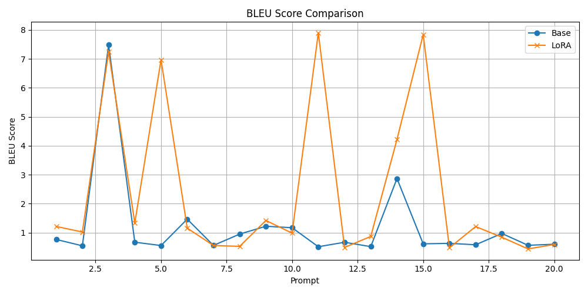
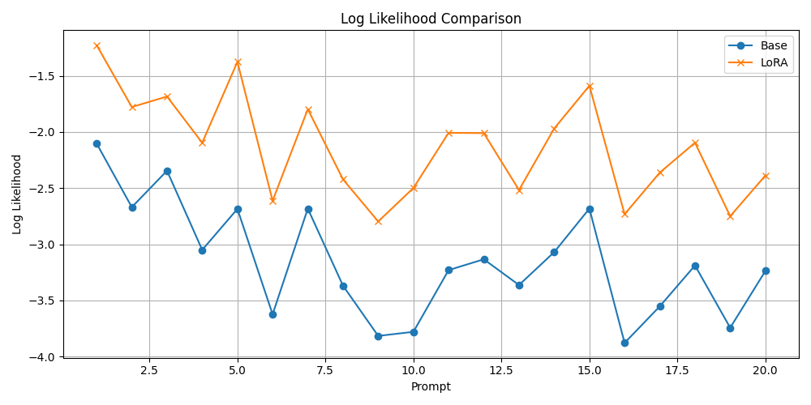

# AI Technical Support Chatbot

An offline, efficient chatbot fine-tuned using LoRA on the TinyLLaMA-1.1B-Chat-v1.0 model for technical support-related conversations. It runs entirely on local hardware and includes training, evaluation, and inference pipelines.

---

## 🚀 Overview

This project demonstrates how to:

* Collect and preprocess real-world technical Q\&A data
* Fine-tune a quantized large language model (LLM) using Low-Rank Adaptation (LoRA)
* Evaluate the improvements using standard NLP metrics
* Deploy the final model as a local command-line chatbot

---

## 🧱 Project Structure

```
AI-Technical-Support-Chatbot/
├── chatbot_cli.py               # Final CLI chatbot interface
├── pre_processing.py            # Merge and format scraped data
├── web_scraper_frameworks.py    # Scraper for GitHub/Ubuntu technical Q&A
├── finetune.py                  # Fine-tuning with LoRA
├── compare_models_plot.py       # Evaluation of Base vs LoRA model
├── test_prompts.json            # Prompts with ground truth outputs
├── tinyllama-lora-output/       # LoRA adapter outputs
├── merged-tinyllama-chatbot/    # Final merged model directory
├── results/                     # Evaluation plots and metrics
│   ├── bleu_comparison.png
│   ├── loglikelihood_comparison.png
│   └── rouge_comparison.png
└── detailed_results.csv         # Metrics and generations per prompt
```

---

## 🛠️ Setup Instructions

### 1. Create a virtual environment

```bash
python -m venv venv
source venv/bin/activate  # On Windows: venv\Scripts\activate
```

### 2. Install dependencies

```bash
pip install -r requirements.txt
```

---

## ⚙️ Usage Instructions

### 🔹 Step 1: Preprocess Raw Data

Merge and convert scraped QA data into instruction format.

```bash
python pre_processing.py
```

### 🔹 Step 2: Fine-Tune the Base Model using LoRA

Fine-tune TinyLLaMA using PEFT (LoRA) on your custom dataset.

```bash
python finetune.py
```

### 🔹 Step 3: Evaluate Base vs Fine-Tuned Model

Compare log-likelihood, BLEU, and ROUGE-L scores across a test set.

```bash
python compare_models_plot.py \
  --base_model TinyLlama/TinyLlama-1.1B-Chat-v1.0 \
  --lora_path ./tinyllama-lora-output \
  --test_prompts ./test_prompts.json \
  --output_dir ./results
```

### 🔹 Step 4: Merge LoRA Adapter with Base Model (optional)

This creates a single deployable model directory (done internally in training).

---

### 🔹 Step 5: Run the CLI Chatbot

Run the chatbot locally using your merged model:

```bash
python chatbot_cli.py
```

Type your question and press Enter. To exit, type `exit`.

---

## 📊 Evaluation Results

### BLEU Score Comparison

Shows surface-level lexical overlap between generations and reference answers.



---

### Log Likelihood Comparison

Lower (less negative) values indicate higher model confidence in ground-truth answers.



---

### ROUGE-L Score Comparison

Captures sequence overlap structure and phrase alignment.


---

## 📌 Daily Log Insights

Throughout the project:

* Learned the efficiency of **LoRA adapters** (only a small fraction of weights are trained).
* Used `bnb_4bit_quant_type="nf4"` to run LLaMA on RTX 3060 in 4-bit precision.
* Fine-tuned with `r=16`, `alpha=32`, and `dropout=0.05`.
* Understood metric trade-offs: BLEU is strict, ROUGE-L captures structure better, and log-likelihood reflects internal model confidence.
* Created an inference-ready chatbot CLI using the merged model, with no reliance on internet or cloud services.

---

## 📄 License

This project is licensed under the MIT License.

---

Let me know if you'd like:

* A Markdown export of this
* The CLI chatbot script named properly as `chatbot_cli.py`
* Docker packaging for deployment

Would you like me to automatically generate the chatbot CLI if it’s not already present?
